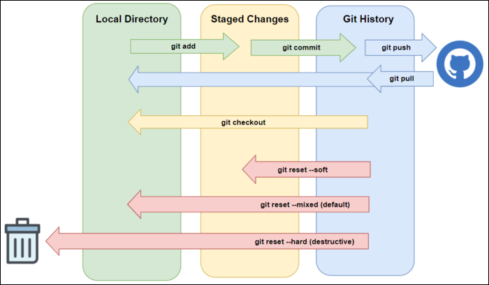

# PlatformIO Commands

To familiarize yourself with the PlatformIO GUI, read this [guide](platformio_compiling.md).

Before running any of the following commands, you need to install PlatformIO CLI. 
Read [the installation guide](../installation/installation.md) to learn how to install PlatformIO CLI.
The GUI does not require the CLI. 

If have done the native PlatformIO installation, I would recommend sticking to the GUI. However, 
if you are working inside the Docker container, PlatformIO CLI is installed by default.

---

```bash
pio run
```
Compiles the PlatformIO project. Must be run in the same directory as the platformio.ini file. 
Same as clicking the checkmark button.

---

```bash
pio run --target upload
```
Compiles the PlatformIO project and tries to upload it to the microcontroller. Must be run in the same directory as the platformio.ini file. Same as clicking the checkmark button.

---


```bash
pio run --target clean
```

Cleans out the build directory in `.pio/build`, deletes all compiled objects. Same as clicking the garbage can icon.

---

```bash
pio check
```

Runs cppcheck on the project. Read [this guide](platformio_checks.md) to learn about code checking tools.
Same as going to PIO home and running `Inspect`.

---

# Git Commands




```bash
git push
```

Pushes your changes to your branch.

I’d highly recommend using built-in Git integrations in your text editor of choice instead, but this is always an option for the Vim/Emacs chads out there.

---
```bash
git pull
```

Get the newest version of your branch.

You can use the flag --recursive-submodules if you’d like to update submodule content as well, since by default github ignores submodules with any commands you enter.

---
```bash
git commit -m “<Message describing your commit>”
```

Creates a snapshot of the changes you’ve made to the repo before you push. The -m flag allows you to include a message describing what the commit does. Do this before you push.

---
```bash
git add <filename>
```

Adds 1 file you changed to the staging area. This needs to be done before you do git commit.

---

```bash
git add -A
```

Adds all files and file deletions to the staging area. This needs to be done before you commit.

---

```bash
git fetch
```

Dowloads commits, files, and references from a remote repository into your local repository.

If you’re unable to checkout to a new branch or having issues with the remote repository in general, try using this command.

---
```bash
git stash
```

Use to save your progress on a given branch before swapping

---
```bash
git stash pop
```

Use to restore previously stashed progress

---
```bash
git branch
```

See all local branches

---
```bash
git branch -r
```

See all remote branches

---
```bash
git checkout <name of branch>
```

Swap to a specific branch

---
```bash
git submodule sync
```

Updates submodule metadata (the URL you linked in .gitmodules)

---
```bash
git submodule update --init
```

Initializes and pulls any changes for every submodule. Use this if you are missing a specific submodule package during build!

---


### [Return to Documents](../README.md)