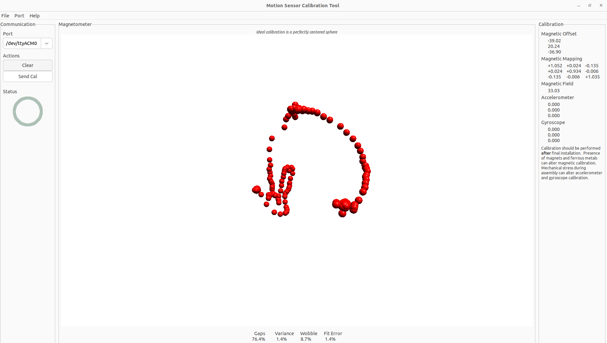
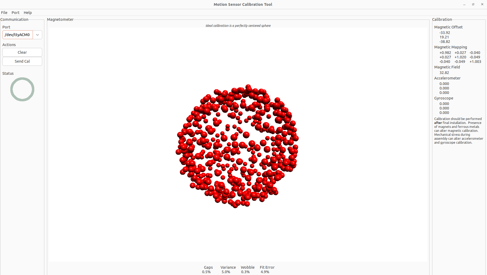

# IMU Calibration

In order to get accurate IMU measurements, you must calibrate it.
In particular, you must calibrate the magnetometer.
You can also calibrate the accelerometer and gyroscope, but the magnetometer must be calibrated.

### IMU: Adafruit LSM6DS3 + LIS3MDL

This process should work for any IMU (accelerometer + gyroscope + magnetometer).
The most important part to copy is the `Serial.print` message in the `loop()` followed by `delay(10)`.


### Download MotionCal

MotionCal is a nice tool to help you calibrate the magnetometer.
You can download it here: https://www.pjrc.com/store/prop_shield.html
I tested MotionCal on Windows and Linux.

I was able to build MotionCal from source on Ubuntu 22.04 LTS:
```bash
git clone https://github.com/PaulStoffregen/MotionCal.git
cd MotionCal/
sudo apt install libwxgtk* -y
sudo apt install libwxgtk-media3.0-gtk3-0v5 libwxgtk-webview3.0-gtk3-0v5 -y
sudo apt install libwxbase3.0-0v5 -y
sudo apt install libwxbase3.0-dev -y
sudo apt install xorg-dev libglu1-mesa-dev freeglut3-dev -y
make -j $(nproc)
./MotionCal
```

### Flashing the MCU

Flash the QTpy SAMD with the calibration program. If you open the Serial console, you should see messages being printed:
```bash
Raw:-5606,5790,-1876,26,59,217,42,-391,-66
```

### Doing the Calibration

Launch MotionCal with the microcontroller + IMU plugged in. Close out of any serial consoles.
Select the serial port from the dropdown. If it is working correctly, you should see red spheres popping up on your screen.



Start spinning the IMU around in all orientations. 
Your goal is to create a sphere with the red dots; the calibration is successful when the "Gaps" value is very low (ideally below 1%).
If the "Gaps" value isn't decreasing anymore, look on the screen where the red spheres are appearing. 
Try to orient the IMU so that new red spheres pop up in empty spaces in the sphere.



Once the "Gaps" value is very low, look at the **Magnetic Offset** and **Magnetic Mapping** values. 
These values are the hard iron and soft iron calibration values for the magnetometer! 

* copy the **Magnetic Offset** values into the `hard_iron` array in the code.
* copy the **Magnetic Mapping** values into the `soft_iron` matrix in the code.

### Validating the Calibration

If you want to validate the magnetometer calibration values, perform the calibration again with the calibration values set.
After doing the calibration again, if the **Magnetic Offset** vector is close to the zero vector and the **Magnetic Mapping** matrix is close to the identity matrix, your calibration is good.
